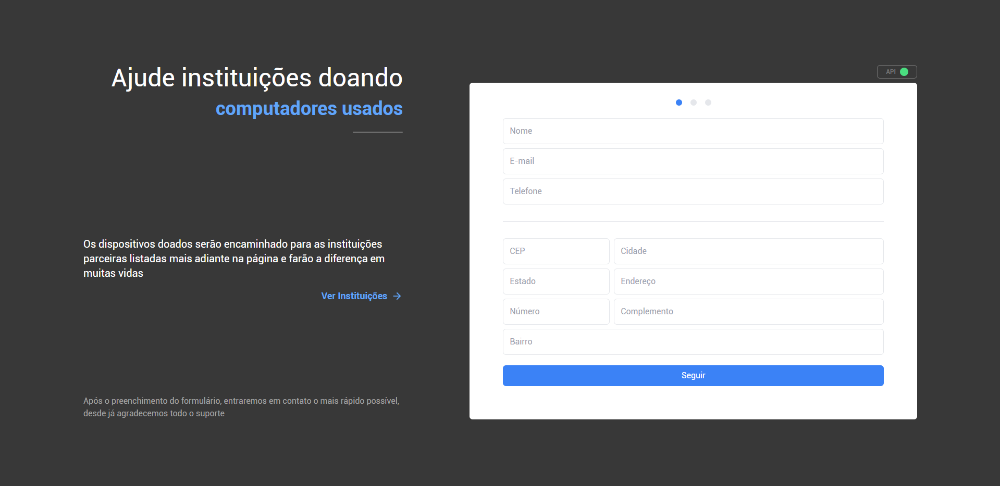
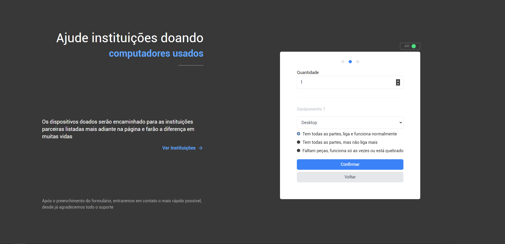
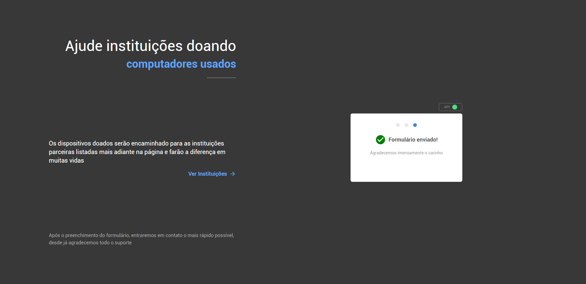
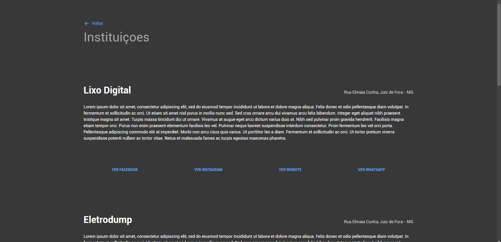

# Processo Seletivo para estágio na AppMasters - Doação de Computadores
## Sumário
1. [Resumo](#resumo)
   - [Ferramentas](#ferramentas)
   - [Variáveis de Ambiente](#variáveis-de-ambiente)
2. [Screenshots](#screenshots)
3. [Package.json](#packagejson)

## Resumo
Este projeto serve exclusivamente ao propósito do processo seletivo da AppMasters e seus desfechos.

Para ver como ficou, [visite a página do app.](
https://appmasters-doar-computadores.vercel.app/)

### Ferramentas
Confira abaixo as principais ferramentas e frameworks utilizados para a construção do projeto 
<table>
  <tr>
    <td>Framework</td>
    <td>NextJS</td>
  </tr>
  <tr>
    <td>Typescript</td>
    <td>Sim</td>
  </tr>
  <tr>
    <td>CSS Framework</td>
    <td>Tailwind</td>
  </tr>
  <tr>
    <td>API Client</td>
    <td>Axios</td>
  </tr>
  <tr>
    <td>Deployment</td>
    <td>Vercel</td>
  </tr>
  <tr>
    <td>Layout</td>
    <td>Figma</td>
  </tr>
</table>

### Variáveis de ambiente
O projeto conta com variáveis de ambiente para o funcionamento devido, as mesmas podem ser configuradas a partir do exemplo em **.env.example**
<table>
  <tr>
    <td>NEXT_PUBLIC_API_BASEURL</td>
    <td>BaseURL da API</td>
  </tr>
</table>

## Screenshots





## Package.json
```
{
  "name": "appmasters-doar-computadores",
  "version": "0.1.0",
  "private": true,
  "scripts": {
    "dev": "next dev",
    "build": "next build",
    "start": "next start",
    "lint": "next lint"
  },
  "dependencies": {
    "@reduxjs/toolkit": "^1.8.3",
    "axios": "^0.27.2",
    "classnames": "^2.3.1",
    "next": "12.2.3",
    "react": "18.2.0",
    "react-dom": "18.2.0",
    "react-icons": "^4.4.0",
    "react-input-mask": "^2.0.4",
    "react-redux": "^8.0.2",
    "redux": "^4.2.0"
  },
  "devDependencies": {
    "@types/classnames": "^2.3.1",
    "@types/node": "^18.6.1",
    "@types/react": "^18.0.15",
    "@types/react-input-mask": "^3.0.1",
    "@types/react-redux": "^7.1.24",
    "autoprefixer": "^10.4.7",
    "eslint": "8.20.0",
    "eslint-config-next": "12.2.3",
    "postcss": "^8.4.14",
    "tailwindcss": "^3.1.6",
    "typescript": "^4.7.4"
  }
}
```